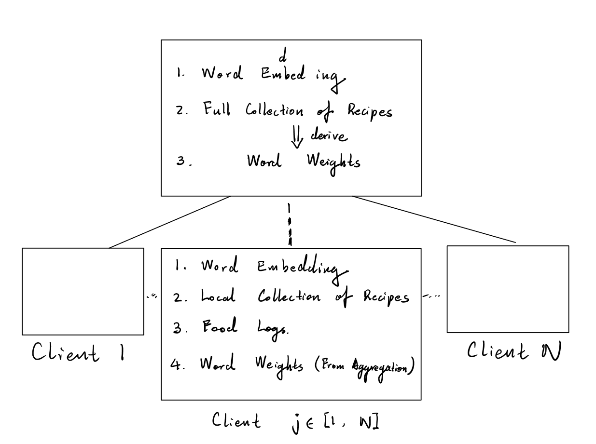

# General Learning Task Description

## Context
    
We make food recommendations based on the similarity of **Food Log Embedding**, e.g. what people have in their refrigerator, and **Recipe Embedding**, or the full set of ingredients required for the dish. The training task should be the **fine-tuning** of Word Vectors (*GloVe50*) with **supervised learning.** In this case, the word vectors can represent Ingredients & Recipes better. 

The word vectors are pre-trained upon general corpus, mostly irrelevant to cooking. In contrast, the tuned ingredient vectors focus on expressing the "flavors" of food. For example, the correlation between the pre-trained word vectors of *Onion* and *Pepper* may not be significant. However, intuitively, we know that both of these two ingredients are often for spicy dishes, i.e., they have **similar semantics regarding cooking or nutritional facts.**

The basic idea is as follows: Each client may **not follow a recipe completely.** For instance, the client may substitute milk with oat milk when making a cup of latte. When trained upon this pair of Food Log and Recipe, the word vectors for oat milk and normal milk will become more similar to each other.

## Basic Settings

The training objective is to make the **Food Log Embeddings** and corresponding **Recipe Embeddings** as "close" as possible (there can be multiple evaluation metrics, e.g., *the cosine similarity*). To simplify the problem, we can adopt the baseline method for sentence embedding from [**A Simple But Tough-to-Beat Baseline for Sentence Embeddings**](https://openreview.net/pdf?id=SyK00v5xx) by Princeton, a weighted average of vectors in the sentence and the weights are dependents of the corpus only. **Note however, There are TWO sets of weights. one for the Food Logs (VARIABLE) and one for the Cookbook (CONSTANT).** The word vectors are the only trainable parts.

## Training Process

The training process will be similar to [**SEEC: Semantic Vector Federation across Edge Computing Environments**](https://arxiv.org/abs/2008.13298) by IBM. They designed the system for a P2P scenario, so there is not a dedicated server. But there has to be some machine coordinating the training for the *FedAverage* optimization algorithm.

In general:

- Server aggregate and distribute the Word Embeddings to edge devices
- Server distribute Word Weights for the Cookbook (full recipe collection)
- Server aggregate and distribute Word Weights for Food Logs
- Each edge device performs training with on-device data locally
- Aggregate gradients with the *FedAverage*

## Data

Below I will use **(Word <--> Ingredients)** and **(Sentence <--> Recipe)** interchangeably.

* Client Side (Edge Devices):
  * Word Weights (Refer to the Princeton paper)
    * This is aggregated and distributed by central server
  * Word Embedding
    * This is distributed by central server
    * according to my calculation, the file size (roughly 5M) should be acceptable, since we are only storing embeddings for ingredients.
  * Food Log (Model Input)
    * Food Log embeddings should be computed on edge device.
  * Recipe Collection Subset
    * Same as the server copy, merely a subset
    * Recipe embeddings should be computed on edge device.

* Server Side:
  * Word Weights (Refer to the Princeton paper)
    * Compute and distribute to edge devices
  * Word Embedding
    * Perform secured aggregation
  * Recipe Collection ("the Cookbook")
    * For embedding weights calculation only

## Architecture Diagram

